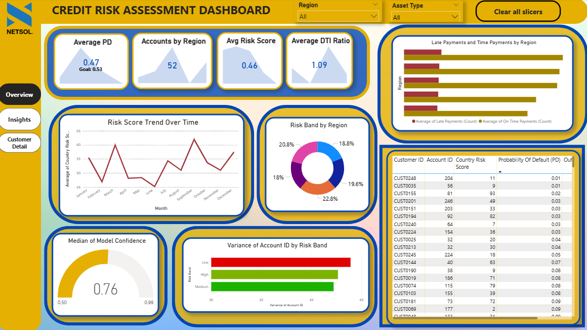
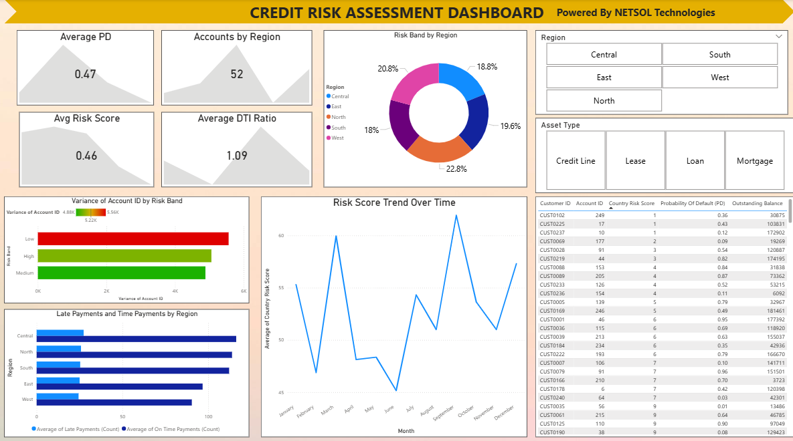
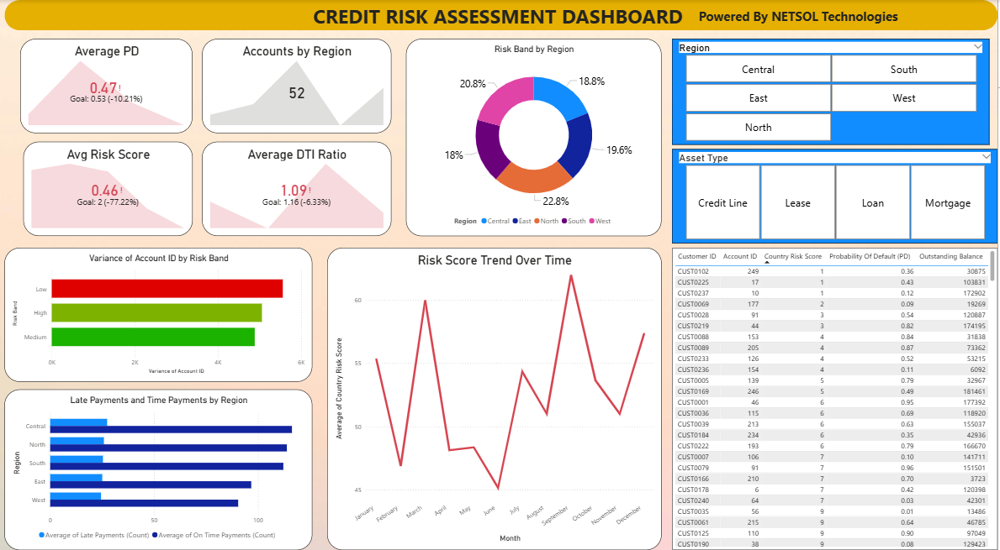
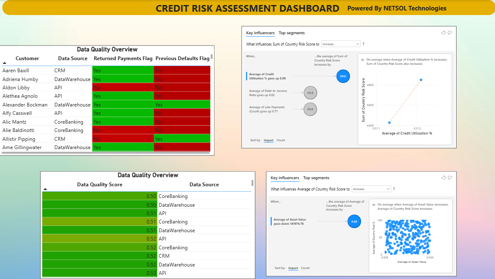
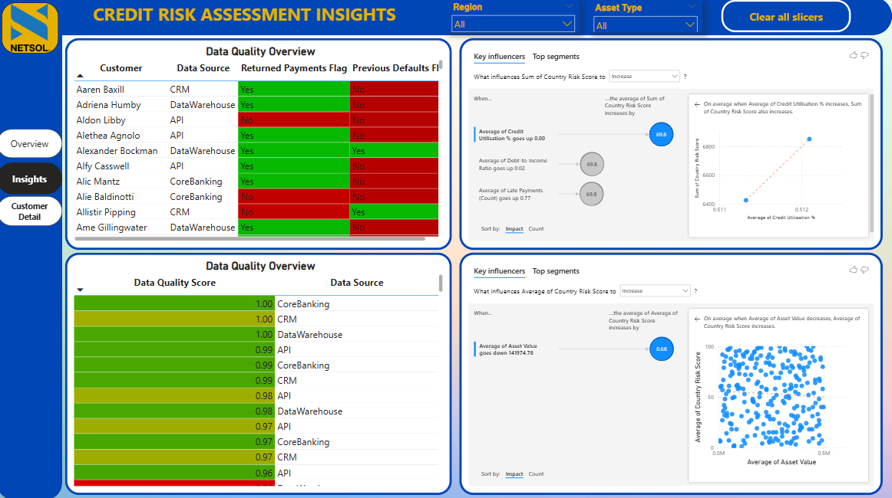
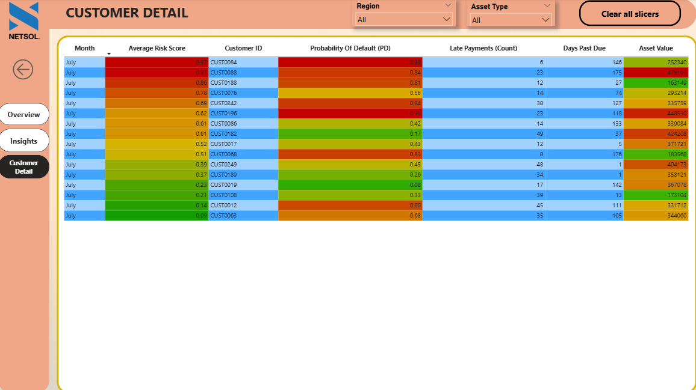

# Credit Risk Assessment Dashboard

**Author:** Sahil Faraz | **Date:** November 2025

> **Academic Disclaimer:** This repository contains an academic project for the **Pearson B-TEC HND in Digital Technologies (Cybersecurity) - Unit 21: Emerging Tecnologies** module. It is strictly for portfolio and demonstration purposes. Other students may not use or copy this material for their own academic submissions.
---

## 📌 Project Overview
This repository contains a Power BI dashboard designed for NETSOL Technologies (A Hypothetical Company) to evaluate financial risk within the asset finance and leasing industry. It simulates the integration of Artificial Intelligence (AI) to automate and enhance credit evaluations, replacing manual spreadsheet-based processes with dynamic, data-driven insights.
### Dashboard Overview

> **Note:** The interactive `.pbix` file is available in the `Dashboard/` folder.
### [Link to the Dashboard](https://app.powerbi.com/view?r=eyJrIjoiYzNiMGE5ZjktNjNlOS00NWQzLTlmOTYtNWYxYzVkZWEwYmE5IiwidCI6IjkwZGYzMGEwLTRlNDMtNGE1YS05NDE3LWY0MTNlNTcwNWY2MCIsImMiOjl9)

## 🚀 Key Features & Highlights
*   **Predictive Analytics:** Visualizes machine-learning model outputs, including risk scores and probability of default (PD) rates.
*   **Model Explainability:** Features an AI insights panel utilizing SHAP (SHapley Additive exPlanations) principles to reveal the top contributing financial variables behind each risk prediction.
*   **Data Quality Governance:** Includes automated data-validation tracking to immediately flag missing timestamps, inconsistent schemas, or poor data quality before analysis.
*   **Interactive Drill-Throughs:** Allows users to navigate from high-level regional risk distributions down to granular, individual customer details and payment histories.

## 📊 Iterative Development Process
This dashboard was built using a user-centered, iterative design process to ensure it met the strict compliance and workflow needs of financial analysts:
### **Iteration 1:** 
Established core metrics (Average PD, Risk Score Trends) and basic visual analytics for initial evaluation.

### **Iteration 2:** 
Introduced the Data Quality Overview panel to address analyst concerns regarding source data discrepancies and interpretability.

### **Iteration 3:** 
Added the "Credit Risk Assessment Insights" and "Customer Detail" panel to increase transparency around the AI model's choices, alongside dynamic tooltips and a dedicated customer drill-through page.

## 📂 Repository Contents
*   `Dashboard/`: Contains the functional `Power BI Credit Risk Assessment Dashboard.pbix` file and also `Prototype Dashboard.pbix`, `Iteration 1.pbix` and `Iteration 2.pbix`
*   `Datasets/`: Contains the dataset used to make the Power BI dashboard.
*   `Images/`: Contains exported screenshots of the dashboard's various pages and iterations for quick viewing.

## 🛠️ Technologies Used
*   **Data Visualization & Analytics:** Microsoft Power BI
*   **Core Concepts:** Artificial Intelligence (AI), Machine Learning (ML) Integration, Data Governance, Financial Risk Modeling
